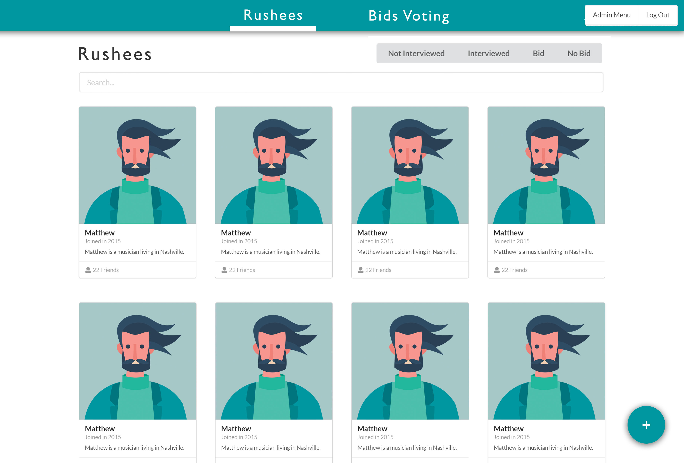
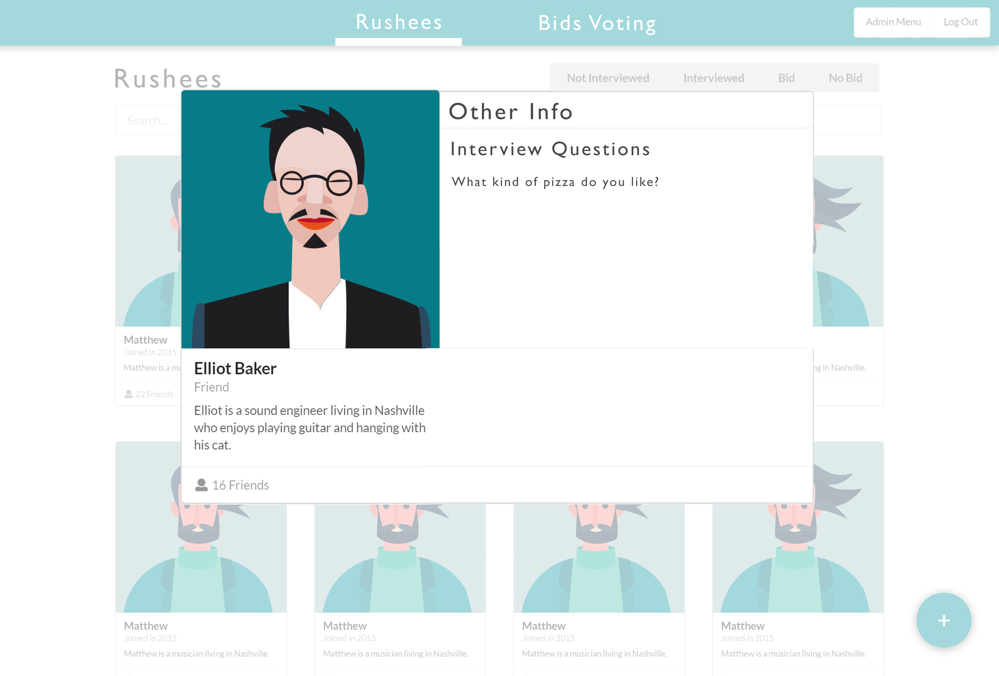

# RushRoster

RushRoster is a React web-app designed to allow fraternities the ability to manage their potential new members (PNM). 

## Problem
Rush chairs act as the interface between the brotherhood and the PNMs. They interview worthy prospects, ask interview questions, and rate them. They also have to create presenations to the brotherhood on the PNMs, and host multiple rounds of voting to determine who gets a bid. All of this data is usually contained in a spreadsheet for the brotherhood to view, having very wide rows, hidden text due to small cells, and overall a very poor user experience. There is a lot of work that the rush chairs have to do to manage and communicate PNM data.

## Solution

RushRoster is designed for ease of use and viewing for the rush chairs as well as the brotherhood. The app will contain sections for viewing PNMs and viewing the rounds of bids (whether certain PNMs have a bid, the results of each round of voting). The PNMs will be represented as a list, each item containing basic information, and is one click away from showing a more detailed view. Rush chairs will have special privileges being able to add/edit PNMs in the database, populating the list. Brothers will also be able to add comments to each PNM, as well as submit requests to the chairs to add/update information and PNMs (to prevent data griefing). The bids voting section will be a three-columned list of PNMs that can be added by the rush chairs, each list item is a PNM, their name, picture, and voting result (bid, no bid, abstain (push to next round of voting)). Clicking on the item will show the detailed view. There can be the same PNM in multiple columns if they were abstained on voting. This way allows people to understand that voting already occurred and to resume previous converations. 

## Use cases

 - CRUD PNMs
 - CRUD PNMs from rounds of voting
 - Ease of view and manipulation for each operation

## Technical concepts

 - Persistence, DB of PNM : name, hometown, major, class; post-interview info: q1, a1 \[,qn, an]\*, interviewer1 thoughts, interviewer1 rating \[,intervieweri thoughts, intervieweri rating]\*, comments, upvotes/downvotes, voting result, picture, date of add
 - Ease of interaction to CRUD data
 - Ease of sight in viewing data
 - Sorting, filtering lists by voting results, name, date, hasInterview
 - Secure login and privileges 
    - Conditional rendering
